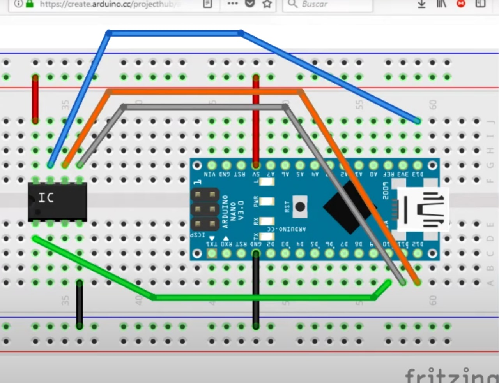
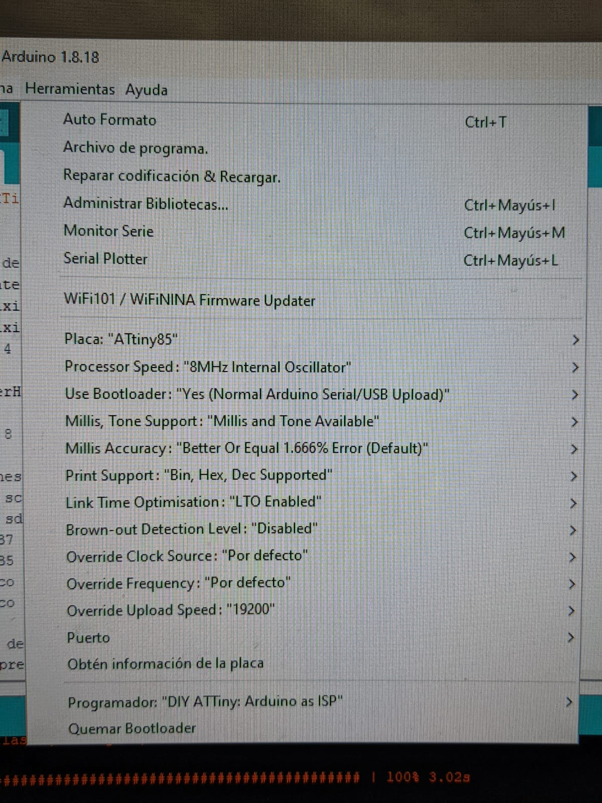
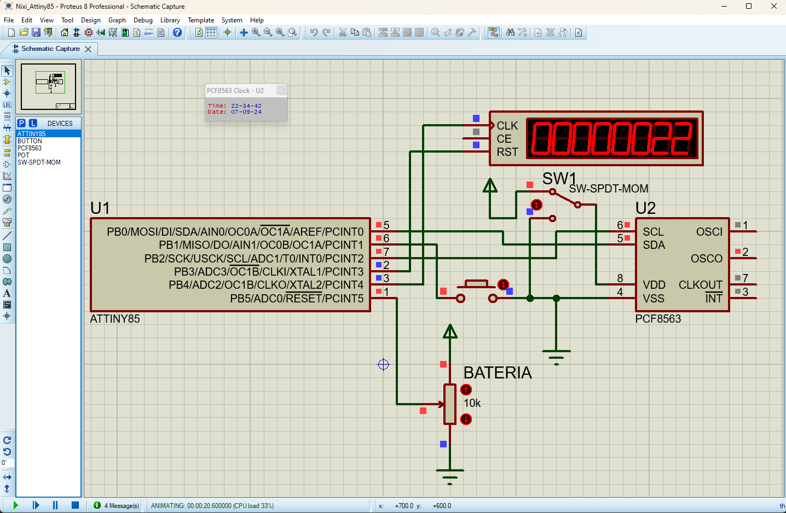
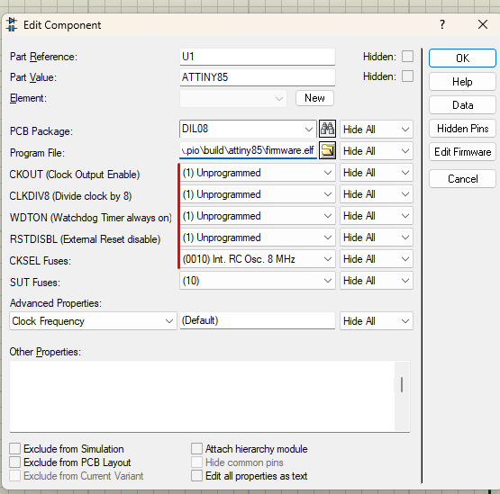
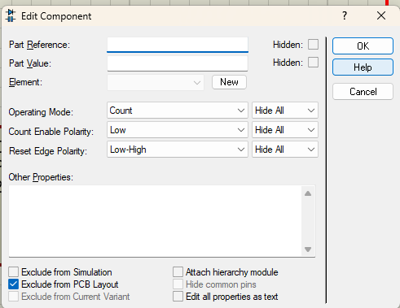
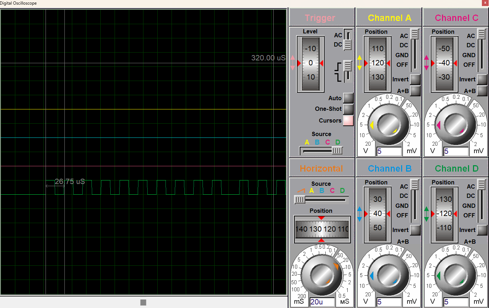

## Proyecto Reloj Nixie DIY con ATtiny85

### Funcionalidades del Programa:

1. **Visualización de la Hora**:
   - Al presionar el botón "Ver Hora", se activa la secuencia para mostrar la hora en los tubos Nixie.
   - Los dos dígitos de la hora actual se muestran durante **0.9 segundos**.
   - Después, los tubos Nixie se apagan por **0.1 segundos**.
   - A continuación, se muestran los dos dígitos de los minutos actuales por **0.9 segundos**.
   - Finalmente, los tubos Nixie se apagan nuevamente por **0.1 segundos**.

2. **Estado de la Batería *(unstable)***:
   - Al mantener presionado el botón "Ver Hora" durante **1 segundo**, se activa la lectura de la batería.
   - El sistema mide la tensión de la batería a través de un ADC y muestra el porcentaje de carga en un rango del 0% al 99% durante **1.5 segundos**.

---

### Cómo Subir el Programa al ATtiny85 (con Arduino Nano)

1. **Uso de Arduino IDE**:
   - Se recomienda utilizar la versión **1.8.18** del Arduino IDE.

2. **Agregar URL del Gestor de Placas**:
   - En el menú **Preferencias**, en la sección de **Gestor de URLs Adicionales**, añade el siguiente enlace y reinicia el IDE:
   ``` 
   https://raw.githubusercontent.com/sleemanj/optiboot/master/dists/package_gogo_diy_attiny_index.json 
   ```

3. **Instalar el Paquete DIY ATtiny**:
   - Ve al menú:
     - **Herramientas** > **Placas** > **Gestor de Placas**.
   - Busca e instala el paquete **DIY ATtiny**, versión **2023.4.19.gcc5.4**.

4. **Conectar el Arduino Nano como ISP**:
   - Conecta el Arduino Nano al ATtiny85 como ISP según el siguiente diagrama:
   

5. **Configurar Arduino Nano como Programador ISP**:
   - Abre el ejemplo preinstalado **"ArduinoISP"** en el IDE:
     - **Archivo** > **Ejemplos** > **11.ArduinoISP**.
   - Carga este sketch en el Arduino Nano para configurarlo como programador ISP.

6. **Cargar la Configuración del ATtiny85**:
   - Asegúrate de configurar correctamente el ATtiny85 en el IDE, como se muestra en la imagen:
   

7. **Descargar el programa y subir**
-  descargar el archivo *"nixie_v1.1_ATtiny85.ino"* con su carpeta del mismo nombre
- abrir el programa dede el ide de arduino
   -  **Archivo** > **Abrir** > buscas y seleccionas el archivo descargado.
- subir usando el programador ArduinoISP
   -  **Programa** > **Subir Usando Programador**
> NO USAR EL BOTON DE SUBIR PROGRAMA CLASICO

---

### Cómo Ver la Simulación

- El archivo de simulación con **Proteus** se encuentra en:  
  `"/simulacion/Nixi_Attiny85.pdsprj"`
  
- El archivo compilado del proyecto con **PlatformIO** está en:  
  `"/.pio/build/attiny85/firmware.hex"`

  Si este archivo no está disponible, debe compilarse utilizando **PlatformIO** con las configuraciones del archivo `platformio.ini`.

- El archivo de simulación incluye los siguientes componentes conectados:
  - Microcontrolador **ATtiny85**
  - RTC **RCF8563**
  - **Pulsador** boton general
  - **switch** para simular fallo de RTC
  - **Contador de clocks** que simula los tubos Nixie

- Diagrama general de conexiones de la simulación:
  

- Configuración del **ATtiny85** en la simulación:
  

- Se recomienda configurar el **contador de clocks** de la siguiente manera para que funcione como controlador Nixie:
  

- Medicio de periodo de los **pulsos** generados por el ATtiny85
   

---

### Notas adicionales :
- Al medir la señal de salida en el simulador se corrobora que la señal de clock generada para comunicar el contador a los CD4017 esta dentro de los valores aceptables. La frecuencia generada es de 38KHZ, y el CD4017 maneja hasta 2.5MHZ trabajando a con tension.
- Al subir el programa puede encontrar algunos errores tipicos de la placa personalizada, recomendacion ejecutar el ARDUINO IDE como administrador, intentar subir el bootloader y luego subir el programa con el programador. Esta secuencia de pasos demostro ser la unica efectiva en la experiencia (posiblemente por algun tipo de defecto en ATtiny85 espesifico utilizado)
- La medicion de bateria solo funciona en ATmega328p
> al usar la libreria Wire en ATmega328p, se usa interrupciones, si el I2C no tiene pull-up, o se cortocicuita a tierra, el microcontrolador quedara bloqueado en espera de los pulsos de respuesta en la comunicacion con PCF8563
